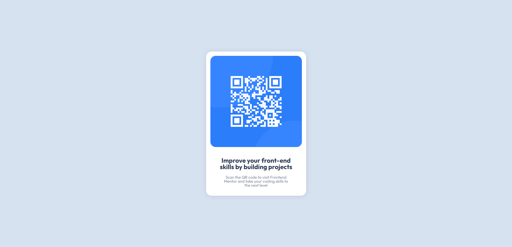

# Frontend Mentor - QR code component solution

This is a solution to the [QR code component challenge on Frontend Mentor](https://www.frontendmentor.io/challenges/qr-code-component-iux_sIO_H). Frontend Mentor challenges help you improve your coding skills by building realistic projects.

## Table of contents

- [Overview](#overview)
  - [Screenshot](#screenshot)
  - [Links](#links)
- [My process](#my-process)
  - [Built with](#built-with)
  - [What I learned](#what-i-learned)

## Overview

### Screenshot



### Links

- Solution URL: [Solution URL here](https://www.frontendmentor.io/solutions/mobile-first-qr-code-component-IRZl-w8v_K)
- Live Site URL: [Live site URL here](https://berkcan-qr-code.netlify.app/)

## My process

### Built with

- Semantic HTML5 markup
- CSS custom properties
- Flexbox
- Mobile-first workflow

### What I learned

```html
<div class="container"></div>
```

```css
:root {
  --white: hsl(0, 0%, 100%);
  --lightgray: hsl(212, 45%, 89%);
  --grayishblue: hsl(220, 15%, 55%);
  --darkblue: hsl(218, 44%, 22%);
}

.container .text .hero {
  color: var(--darkblue);
}
```
